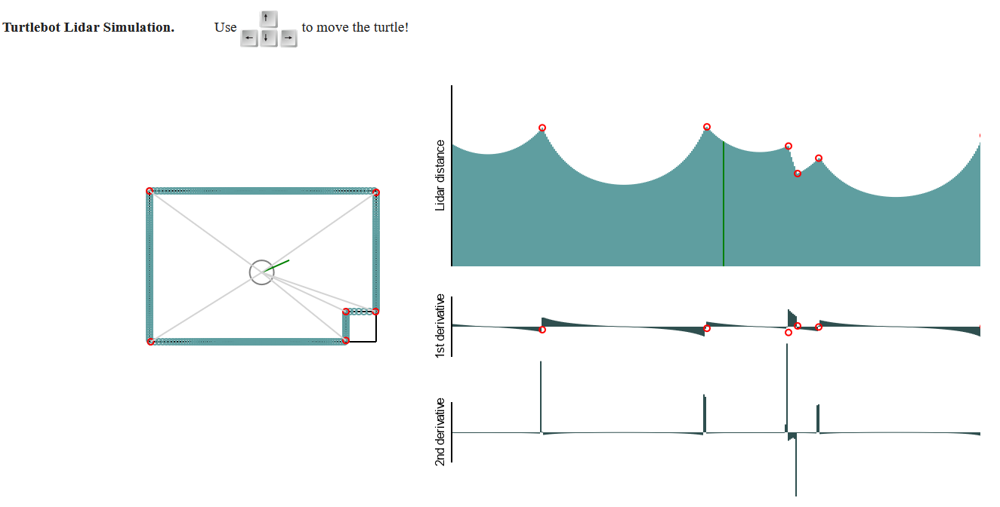

# A 2D Turtlebot with Lidar simulation

## Inspiration

I want to know how my new robotic vacuum cleaner gets its work so well done.

[A demo is available here](https://mirkosertic.github.io/TurtleBotLidar/).

## What does it do?

* Very simple Turtlebot simulation with added Lidar sensor
* All written in HTML5/JavaScript and runs in your Browser
* Visualization of Lidar data
* Simple edge detector to detect contour of observed room

## Show me a screenshot!

## How to build it

Checkout with `git clone https://github.com/mirkosertic/TurtleBotLidar.git` and `npm ci && npm run dev` should do it all.

## What is planned?

* Simulation of Lidar noise
* Simulation of turtle movement noise
* Kalman Filtering
* A very simple SLAM implementation, maybe with Pose-Graph-Optimization
* Derive robot position based from learned map, maybe with Particle-Filters.
